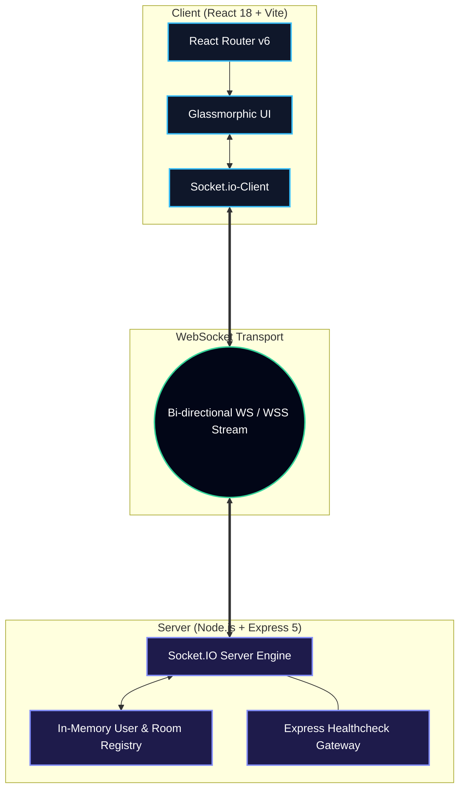

<div align="center">


<br />
<br />

# ⚡ VibeSync

### *Instant, Event-Driven Group Conversations in a Sleek Glassmorphic Interface*

[](https://github.com/kartikeyv-coder/VibeSync/stargazers)
[](https://github.com/kartikeyv-coder/VibeSync/network/members)
[](https://github.com/kartikeyv-coder/VibeSync/issues)
[](https://react.dev/)
[](https://vitejs.dev/)
[](https://tailwindcss.com/)
[](https://socket.io/)
[](https://nodejs.org/)
[](LICENSE)

<br />

```
  ____   ____.__ ___.             _________                     
  \   \ /   /|__|\_ |__   ____   /   _____/__.__. ____   ____  
   \   Y   / |  | | __ \_/ __ \  \_____  <   |  |/    \_/ ___\ 
    \     /  |  | | \_\ \  ___/  /        \___  |   |  \  \___ 
     \___/   |__| |___  /\___  >/_______  // ____|___|  /\___  >
                      \/     \/         \/ \/         \/     \/ 
```

<p align="center">
  <a href="#-the-pitch">About</a> •
  <a href="#-feature-matrix">Features</a> •
  <a href="#-system-architecture">Architecture</a> •
  <a href="#-tech-stack-deep-dive">Tech Stack</a> •
  <a href="#-socket-protocol-specification">Socket Protocol</a> •
  <a href="#-ui--design-system">Design System</a> •
  <a href="#-quick-start">Installation</a> •
  <a href="#-troubleshooting--faq">FAQ</a> •
  <a href="#-roadmap">Roadmap</a>
</p>

</div>

---

## 💡 The Pitch

Most chat applications are either burdened by bloated dependencies, heavy database requirements, and difficult setup processes, or they look like abandoned proof-of-concept projects from 2014.

**VibeSync** strikes the perfect balance:
- **Zero Configuration Barrier**: Spin up the backend and frontend in seconds without configuring external cloud databases.
- **Microsecond WebSocket Latency**: Powered by Socket.IO rooms with lightweight in-memory user registry and room isolation.
- **Modern Dark Glassmorphic Aesthetic**: Built using the bleeding-edge **Tailwind CSS v4** engine with dynamic backdrop filters, ambient neon pulses, and fluid gradients.
- **Bulletproof Room State**: Automated presence tracking, live membership counts, duplicate username blocking, and graceful socket disconnect cleanup.

---

## ⚡ Feature Matrix

<table>
  <tr>
    <td width="50%">
      <h3>🌐 Dynamic Multi-Room Channels</h3>
      <p>Users can jump into any custom room instantly. Messages are scoped strictly to the room members—zero cross-talk, zero message leaks.</p>
    </td>
    <td width="50%">
      <h3>👥 Real-Time Presence Sync</h3>
      <p>A reactive sidebar updates instantly as users join or leave, featuring an active participant counter and glowing online status indicators.</p>
    </td>
  </tr>
  <tr>
    <td width="50%">
      <h3>🤖 Automated System Broadcasts</h3>
      <p>Intelligent admin notifications greet users upon room entry and broadcast departures immediately to remaining participants.</p>
    </td>
    <td width="50%">
      <h3>🛡️ Duplicate Handle Defense</h3>
      <p>In-memory room validation automatically prevents multiple users in the same room from claiming identical nicknames.</p>
    </td>
  </tr>
  <tr>
    <td width="50%">
      <h3>📜 Smooth Smart Auto-Scroll</h3>
      <p>Utilizes <code>react-scroll-to-bottom</code> for frictionless auto-scrolling on new messages while preserving manual review capabilities.</p>
    </td>
    <td width="50%">
      <h3>💎 Ultra-Polished Glass UI</h3>
      <p>Built with high-contrast slate palettes, glowing border accents, custom scrollbars, and tactile interactive button feedback.</p>
    </td>
  </tr>
</table>

---

## 🏛️ System Architecture

### High-Level Topology



---

### Socket Event Lifecycle

```mermaid
sequenceDiagram
    autonumber
    actor Alice as 👤 Alice (Client A)
    participant Server as ⚡ Socket.IO Engine
    actor Bob as 👤 Bob (Client B)

    rect rgb(15, 23, 42)
        Note over Alice,Bob: 1. Room Handshake & Authorization
        Alice->>Server: emit("join", { name: "Alice", room: "TechVibe" })
        Server->>Server: addUser({ id, name, room })
        alt Duplicate Name in Room
            Server-->>Alice: callback({ error: "Username is taken" })
        else Successful Registration
            Server->>Server: socket.join("TechVibe")
            Server-->>Alice: emit("message", { user: "admin", text: "Alice, welcome to the room TechVibe" })
            Server-->>Bob: broadcast.to("TechVibe").emit("message", { user: "admin", text: "Alice has joined!" })
            Server-->>Alice: io.to("TechVibe").emit("roomData", { room, user: [Alice, Bob] })
            Server-->>Bob: io.to("TechVibe").emit("roomData", { room, user: [Alice, Bob] })
            Server-->>Alice: callback()
        end
    end

    rect rgb(20, 27, 45)
        Note over Alice,Bob: 2. Real-Time Chat Broadcast
        Alice->>Server: emit("sendMessage", "Hey everyone! 👋")
        Server->>Server: getUser(socket.id)
        Server-->>Alice: io.to("TechVibe").emit("message", { user: "Alice", text: "Hey everyone! 👋" })
        Server-->>Bob: io.to("TechVibe").emit("message", { user: "Alice", text: "Hey everyone! 👋" })
        Server-->>Alice: callback()
    end

    rect rgb(15, 23, 42)
        Note over Alice,Bob: 3. Disconnect Teardown
        Alice-xServer: Tab closed / Connection drop
        Server->>Server: removeUser(socket.id)
        Server-->>Bob: io.to("TechVibe").emit("message", { user: "admin", text: "Alice has left." })
        Server-->>Bob: io.to("TechVibe").emit("roomData", { room, user: [Bob] })
    end
```



---

## 🛠️ Tech Stack Deep-Dive

<div align="center">

| Layer | Technology | Version | Purpose |
|:---|:---|:---|:---|
| **Frontend Framework** | [React](https://react.dev/) | `^18.3.1` | Component-driven declarative UI state management |
| **Build & Tooling** | [Vite](https://vitejs.dev/) | `^8.2.2` | Ultra-fast Hot Module Replacement (HMR) & ESBuild bundling |
| **CSS Engine** | [Tailwind CSS](https://tailwindcss.com/) | `^4.3.3` | Modern utility-first styling with `@tailwindcss/vite` |
| **Navigation** | [React Router](https://reactrouter.com/) | `^6.22.3` | Declarative client-side routing (`/` and `/chat`) |
| **Realtime Client** | [Socket.io Client](https://socket.io/) | `^4.8.3` | Resilient WebSocket connection with automatic reconnects |
| **Query Parser** | [Query-String](https://github.com/sindresorhus/query-string) | `^9.5.1` | URL parameter serialization and extraction |
| **Scroll Utility** | [React-Scroll-To-Bottom](https://github.com/compulim/react-scroll-to-bottom) | `^4.2.0` | Pin-point auto-scrolling message container |
| **Linter** | [Oxlint](https://oxc.rs/) | `^1.79.0` | High-performance Rust-based JavaScript linting |
| **Backend Runtime** | [Node.js](https://nodejs.org/) | `LTS (>=18)` | Server-side JavaScript execution environment |
| **Web Server** | [Express](https://expressjs.com/) | `^5.2.1` | Minimalist HTTP routing and middleware framework |
| **Realtime Engine** | [Socket.io](https://socket.io/) | `^4.8.3` | Event-driven duplex network gateway with CORS |
| **Dev Monitor** | [Nodemon](https://nodemon.io/) | `^3.1.14` | Hot-reloading watcher for local backend development |

</div>

---

## 📡 Socket Protocol Specification

All WebSocket communication runs over custom named events. Here is the full contract:

### 1. `join` (Client ➔ Server)
Invoked when a user submits their nickname and target room.
- **Direction**: Client ➔ Server
- **Payload**:
  ```json
  {
    "name": "Alex",
    "room": "ReactDevs"
  }
  ```
- **Callback**: Returns an `error` string if the username already exists in the room; otherwise returns empty on success.

### 2. `sendMessage` (Client ➔ Server)
Dispatched when a user submits a chat message.
- **Direction**: Client ➔ Server
- **Payload**: `"Hello everyone!"` (string)
- **Callback**: Triggers after the server broadcasts the message to the target room.

### 3. `message` (Server ➔ Client)
Emitted by the server whenever a new chat or system message occurs.
- **Direction**: Server ➔ Client
- **Payload**:
  ```json
  {
    "user": "Alex", // Or "admin" for system-generated events
    "text": "Hello everyone!"
  }
  ```

### 4. `roomData` (Server ➔ Client)
Broadcasts live room member list changes when users enter or exit.
- **Direction**: Server ➔ Client
- **Payload**:
  ```json
  {
    "room": "ReactDevs",
    "user": [
      { "id": "4kZ...k9A", "name": "alex", "room": "reactdevs" },
      { "id": "9pQ...r3B", "name": "sarah", "room": "reactdevs" }
    ]
  }
  ```

### 5. `disconnect` (Socket Lifecycle)
Triggered automatically when a socket drops connection, refreshing room rosters.

---

## 🎨 UI & Design System

VibeSync was built from the ground up to feel like a high-end desktop client:

```
+-----------------------------------------------------------------------------+
|                                  VibeSync                                   |
|                                                                             |
|  [ # ReactDevs ] ● Active                                               [✕] |
|  +-------------------------------------------------+ +--------------------+ |
|  | [admin] Alex, welcome to the room ReactDevs     | | ONLINE USERS (2)   | |
|  |                                                 | |                    | |
|  | [Sarah]: Does anyone have experience with v4?   | | ● Alex             | |
|  |                                                 | | ● Sarah            | |
|  |               [You]: Yes, the new engine is 🔥  | |                    | |
|  +-------------------------------------------------+ +--------------------+ |
|  [ Type a message...                             ] [ Send Message ]         |
+-----------------------------------------------------------------------------+
```

### Design Tokens

- **Atmosphere**: Deep cosmic radial blend (`from-slate-950 via-slate-900 to-indigo-950`).
- **Glass Surfaces**: `bg-slate-900/80 backdrop-blur-xl border border-slate-800`.
- **Active Presence**: Emerald neon glow (`#34d399` with `drop-shadow-[0_0_6px_rgba(52,211,153,0.9)]`).
- **Typography**: Responsive, crisp sans-serif with distinct color states for admin vs. friend vs. self.
- **Tactile Inputs**: Focus rings featuring Indigo / Cyan transitions (`focus:border-indigo-500`).

---

## 📂 Project Anatomy

```text
VibeSync/
│
├── assets/
│   └── banner.svg                  # High-res SVG banner with typography & mockups
│
├── client/
│   └── Frontend/                   # Client application root
│       ├── public/                 # Static public assets
│       ├── src/
│       │   ├── assets/             # Brand logos & media
│       │   ├── Components/         # Modular React UI components
│       │   │   ├── Chat.jsx        # Root chat screen, socket listener lifecycle
│       │   │   ├── Infobar.jsx     # Header bar with room name & exit link
│       │   │   ├── Input.jsx       # Chat input controller with Enter-key submit
│       │   │   ├── Join.jsx        # Landing authentication & room selection form
│       │   │   ├── Message.jsx     # Individual message bubble (Self vs Other style)
│       │   │   ├── Messages.jsx    # Scroll container powered by react-scroll-to-bottom
│       │   │   └── TextContainer.jsx # Online active users sidebar roster
│       │   ├── Icon/               # Status indicator icons
│       │   ├── App.jsx             # React Router routing setup
│       │   ├── index.css           # Tailwind v4 import & CSS reset
│       │   └── main.jsx            # React root DOM hydration
│       ├── index.html              # HTML5 entrypoint
│       ├── package.json            # Client dependencies & scripts
│       └── vite.config.js          # Vite build configuration with Tailwind plugin
│
├── server/                         # Backend engine root
│   ├── index.js                    # Express initialization, HTTP server & Socket.IO bindings
│   ├── router.js                   # Root router health check (GET /)
│   ├── user.js                     # In-memory user state functions (add, remove, query)
│   └── package.json                # Server scripts & dependencies
│
└── README.md                       # Master documentation
```

---

## 🚀 Quick Start

Get a local copy running up and chatting in under 60 seconds!

### Prerequisites

Ensure you have the following installed on your machine:
- **Node.js**: `v18.0.0` or higher
- **npm**: `v9.0.0` or higher (or `yarn` / `pnpm` / `bun`)

---

### Step 1: Clone the Repo

```bash
git clone https://github.com/kartikeyv-coder/VibeSync.git
cd VibeSync
```

### Step 2: Launch the Backend Server

Open your primary terminal:

```bash
cd server
npm install
npm start
```

```
> server@1.0.0 start
> nodemon index.js

Server has Started on port 8000
```

### Step 3: Launch the Frontend Client

Open a second terminal window:

```bash
cd client/Frontend
npm install
npm run dev
```

```
  VITE v8.2.2  ready in 240 ms

  ➜  Local:   http://localhost:5173/
  ➜  Network: use --host to expose
```

### Step 4: Start Chatting!

1. Open `http://localhost:5173` in your browser.
2. Enter your Name (e.g. `Alex`) and Room (e.g. `GamingLounge`), then click **Sign In**.
3. Open an **Incognito Window** or another browser, enter a second Name (e.g. `Sam`) and the **same Room** (`GamingLounge`).
4. Watch live presence update immediately and chat with zero delay!

---

## 🔧 Scripts & Commands

### Backend (`/server`)

| Script | Command | Action |
|:---|:---|:---|
| `npm start` | `nodemon index.js` | Launches server with live file-watching and automatic restart |
| `npm test` | `echo ...` | Test runner placeholder |

### Frontend (`/client/Frontend`)

| Script | Command | Action |
|:---|:---|:---|
| `npm run dev` | `vite` | Starts local development server on port `5173` |
| `npm run build` | `vite build` | Compiles production assets into `/dist` |
| `npm run preview` | `vite preview` | Serves compiled production build locally for verification |
| `npm run lint` | `oxlint` | Runs fast Rust-powered Oxlint audit across all `.jsx` files |

---

## ❓ Troubleshooting & FAQ

<details>
<summary><strong>Q: I'm receiving a "Connection error" in the browser console.</strong></summary>

> **Solution**: Ensure your server is actively running on port `8000`. If you changed the port on the backend in `server/index.js`, update the `ENDPOINT` variable located at the top of `client/Frontend/src/Components/Chat.jsx`:
> ```javascript
> const ENDPOINT = 'http://localhost:8000';
> ```
</details>

<details>
<summary><strong>Q: Why does the app alert "Username is taken"?</strong></summary>

> **Solution**: VibeSync enforces unique handles per room. If another user in the room has chosen that handle, simply pick a different nickname or enter a different room name.
</details>

<details>
<summary><strong>Q: Can I deploy the backend and frontend separately?</strong></summary>

> **Solution**: Absolutely! You can deploy the backend to Render, Railway, or Heroku, and the frontend to Vercel or Netlify. Just set your deployed server URL as the `ENDPOINT` in `Chat.jsx` (or inject it via an environment variable).
</details>


## 🤝 Contributing

Contributions are the lifeblood of open source. If you'd like to improve VibeSync:

1. **Fork the Repository**
2. **Create a Feature Branch** (`git checkout -b feature/NewAwesomeFeature`)
3. **Commit Your Changes** (`git commit -m "feat: add NewAwesomeFeature"`)
4. **Push to the Branch** (`git push origin feature/NewAwesomeFeature`)
5. **Open a Pull Request**

---

## 📜 License

This project is licensed under the **ISC License**. Feel free to use, modify, and distribute it as you wish.

---

<div align="center">

**Built with passion and modern web tech by [Kartikey](https://github.com/kartikeyv-coder)**

[](https://github.com/kartikeyv-coder)

*If you found VibeSync helpful, please consider giving it a ⭐ on GitHub!*

</div>
